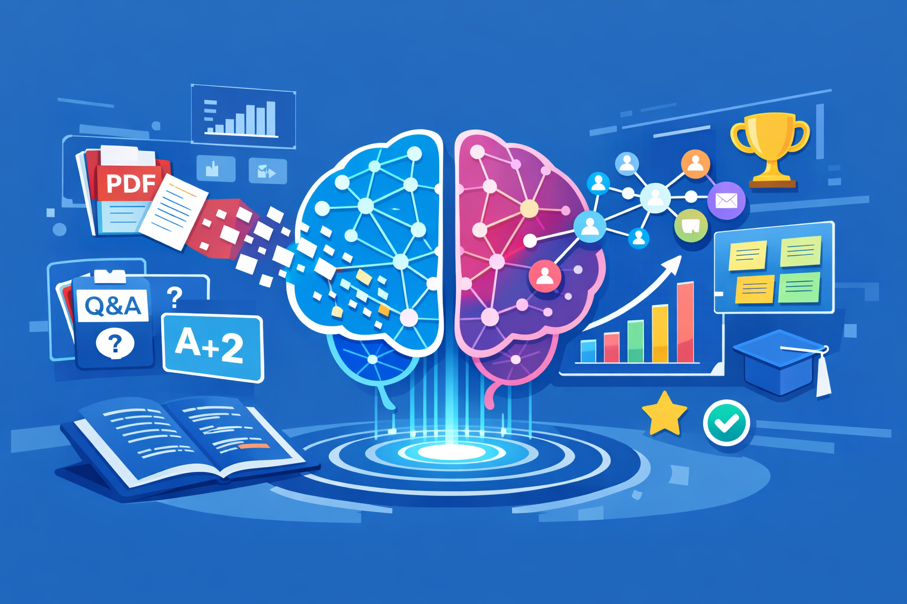

<p align="center">
  
</p>

<h1 align="center">🌪 Vortex</h1>

<p align="center">
AI-Powered Visual Search & Understanding Engine for Students and Researchers
</p>

<p align="center">


</p>

---

## 🎓 Graduation Project

**Bachelor of Computer Science – Taif University (2026)**

| Team Members |
|-------------|
| Reem Abdullah Aldosari |
| Haya Faraj Aldosari |
| Maha Abdullah Alsubaie |
| Rawan Nasser Aldawsari |
| Badour Hamoud Alsubaie |

**Supervisor:**  
Dr. Abir Osman Elfakki  
Department of Science and Technology  
University College of Ranyah – Taif University

---

## 🚀 Project Vision

Traditional academic resources are long, static, and difficult to navigate.

Vortex converts PDFs and slides into:

✅ Smart summaries  
✅ Structured notes  
✅ Mind maps  
✅ Visual graphs  
✅ Interactive quizzes  
✅ Flashcards & gamified challenges  

🎯 Goal: Transform passive reading into active learning.

---

## 🧠 Core Features

| Feature | Description |
|--------|------------|
| ✦ Intelligent Summarization | NLP-powered smart notes |
| ✦ Visualization | Mind maps, tables, graphs |
| ✦ Gamification Engine | Quiz battles & flashcards |
| ✦ Collaborative Learning | Shared study tools |
| ✦ Smart Search | Instant content navigation |

---

## ⚙️ Technology Stack

### Backend

- Python 3.11
- Flask Framework
- Hugging Face Transformers
- NLTK & SpaCy
- SQLite

### Visualization

- Matplotlib
- NetworkX

### Frontend

- HTML / CSS
- Bootstrap

### Deployment

- Flask Local Server
- Render / Railway

---

## 🧩 System Architecture


Document Upload
↓
NLP Processing
↓
Summarization Engine
↓
Visualization Module
↓
Gamification Engine
↓
Interactive Interface


Modular • Scalable • AI-driven

---

## 📊 Performance Metrics

| Metric | Result |
|-------|--------|
| Overall Accuracy | **93.2%** |
| Response Time | Stable |
| Semantic Preservation | High |
| Redundancy Filtering | Reliable |

✔ Verified across PDFs, slides, and research papers.

---

## 🔐 Ethics & Privacy

- 🔒 Uploaded files remain private
- 🚫 No data resale
- 🎓 Academic integrity preserved

---

## 🛠 Installation

```bash
git clone https://github.com/aldawsarir/Vortex.git
cd Vortex
pip install -r requirements.txt
python app.py
```

Then open:

```
http://127.0.0.1:5000
```

---

## 🌍 Future Work

* Multilingual summarization
* LMS integration
* Real-time collaboration
* Cloud AI optimization
* Smart classroom deployment

---

## 📚 Academic Contribution

Vortex demonstrates how AI can:

* Reduce cognitive overload
* Enhance comprehension
* Increase engagement
* Support modern learning ecosystems

It bridges the gap between traditional education and intelligent digital learning.

---

## 📜 License

Academic research project – educational use permitted.

---

## ✨ Acknowledgment

We dedicate this work to students, researchers, and educators seeking smarter ways to learn.

> “And say: My Lord, increase me in knowledge.”
> Quran 20:114
